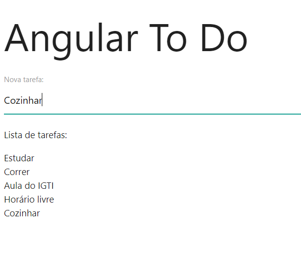

# AngularTodo
* A simple todo with Angular - first project with Angular
* project developed during the [IGTI](https://www.igti.com.br/cursos/mba-em-desenvolvimento-front-end/) front-end development MBA
* Teacher: [Raphael Gomide](https://github.com/rrgomide)

## Angular install 
* This project was generated with [Angular CLI](https://github.com/angular/angular-cli) version 11.2.11.

`npm i -g @angular/cli`

## Dependencies install
`npm i`

## Development server

Run `ng serve` for a dev server. Navigate to `http://localhost:4200/`. The app will automatically reload if you change any of the source files or `ng serve -o`

## App Img 

